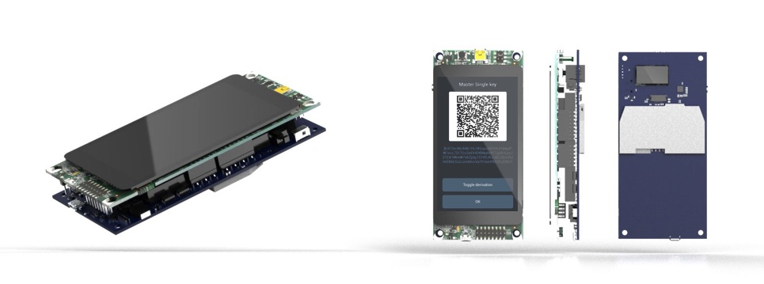
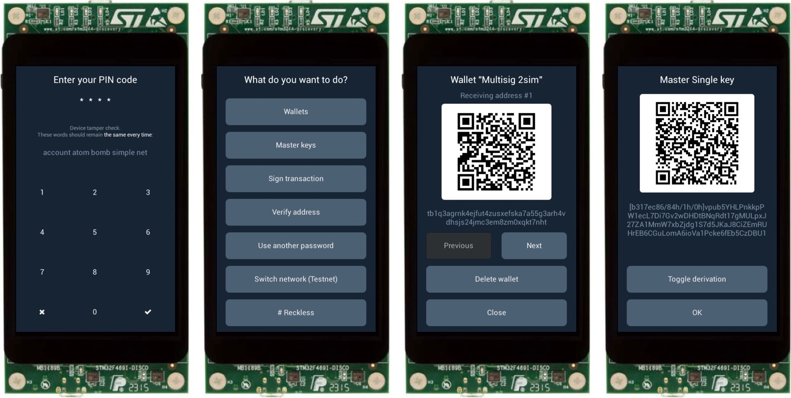
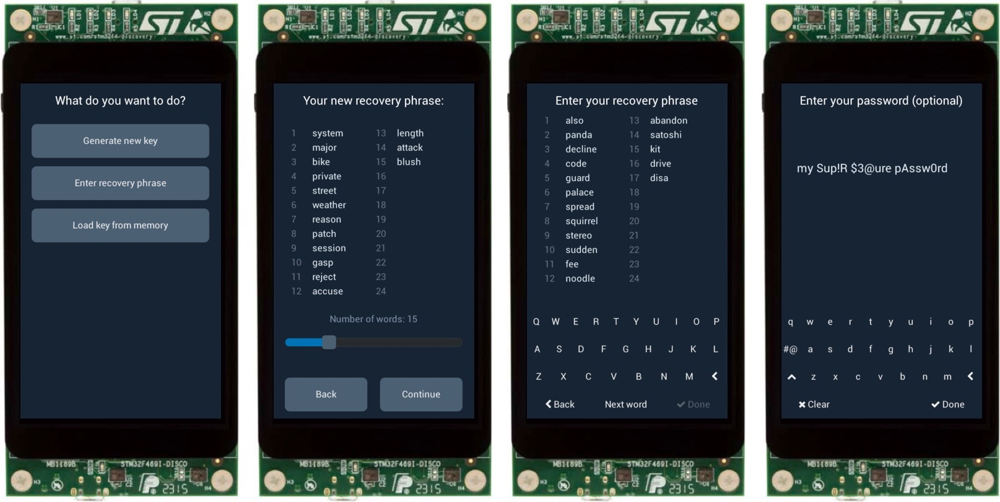

# Specter-DIY

The idea of the project is to build a hardware wallet from off-the-shelf components.
Even though we have [a devkit](./devkit) that puts everything in a nice form-factor and helps you to avoid any soldering, we will continue supporting and maintaining compatibility with standard components.

We also want to keep the project flexible such that it can work on any other set of components with minimal changes. Maybe you want to make a hardware wallet on a different architecture (RISC-V?), with an audio modem as a communication channel - we believe that you should be able to do it. We will try to make it easy to adapt Specter to different functionality and abstract logical modules as much as we can.

By default we assume QR codes for communication, reasonably large screen for GUI. We think that QR codes are the most convenient way to take control over comunication - they have very limited data capacity and purely unidirectional. And it's airgapped - you don't need to connect the wallet to your computer at any time.

For secret storage we support agnostic mode (forgets all secrets when turned off), reckless mode (store secrets in flash of the application microcontroller) and currently working on a secure element integration in the form factor of a smartcard.

Our main focus is multisignature setup with other hardware wallets, but wallet can also work as a single signer. We try to make it compatible with Bitcoin Core where we can - PSBT for unsigned transactions, wallet descriptors for importing/exporting multisig wallets. To communcate with Bitcoin Core easier we are also working on [Specter Desktop app](https://github.com/cryptoadvance/specter-desktop) - a small python flask server talking to your Bitcoin Core node.

Most of the firmware is written in MicroPython which makes the code easy to audit and change. We use [secp256k1](https://github.com/bitcoin-core/secp256k1) library from Bitcoin Core for elliptic curve calculations and [LittlevGL](https://littlevgl.com/) library for GUI.

## DISCLAIMER

This firmware is **WORK IN PROGRESS — USE AT YOUR OWN RISK**, better on testnet. It is not perfectly stable yet - sometimes it crashes. If this happens to you please open an issue and we will try to fix it. Meanwhile try reseting the device (press the black button on the back or powercycle the board).

This wallet is a **FUNCTIONAL PROTOTYPE**. This means we use it to experiment with user interface, communication methods and new interesting features (like anti chosen-nonce protocol, CoinJoin and Lightning). That's why **by default we don't store your private keys on the device** - you need to type your recovery phrase every time you power it on. You still can save your recovery phrase to the device if you wish - there is a setting for that.

If something doesn't work open an issue here or ask a question in our [Telegram group](https://t.me/spectersupport) or [Slack](https://join.slack.com/t/spectersupport/shared_invite/enQtNzY4MTQ2MTg0NDY1LWQzMGMzMTk2MWE2YmVmNzE3ODgxODIxNWRlMzJjZTZlMDBlMjA5YzVhZjQ0NzJlNmE0N2Q4MzE0ZGJiNjM4NTY).

## Documentation

All the docs are stored in the [`docs/`](./docs) folder:

- [`shopping.md`](./docs/shopping.md) explains what to buy
- [`assembly.md`](./docs/assembly.md) shows how to put everything together.
- [`quickstart.md`](./docs/quickstart.md) guides you through the initial steps how to get firmware on the board
- [`security.md`](./docs/security.md) explains possible attack vectors and security model of the project
- [`development.md`](./docs/development.md) explains how to start developing on Specter
- [`simulator.md`](./docs/simulator.md) shows how to run a simulator on unix/macOS
- [`communication.md`](./docs/communication.md) defines communication protocol with the host over QR codes and USB
- [`roadmap.md`](./docs/roadmap.md) explains what we need to implement before we can consider the wallet be ready to use with real funds.

Supported networks: Mainnet, Testnet, Regtest, Signet.

## Video and screenshots

Check out [this Twitter thread](https://twitter.com/StepanSnigirev/status/1168923849699876881) to get an idea how it works.

Here is a [Gallery](./doc/pictures/gallery/README.md) with devices assembled by the community.

A few pictures of the UI:

### Wallet screens

### Key generation and recovery

