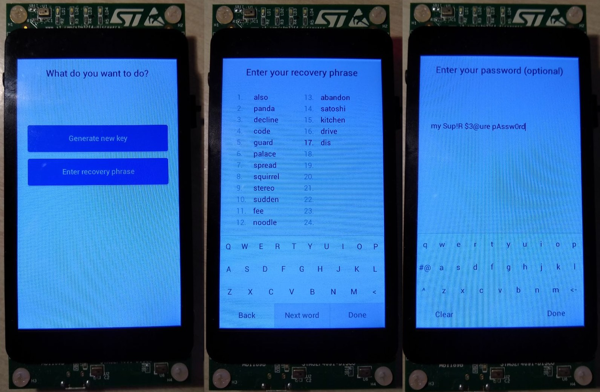

# Specter-DIY

## DISCLAIMER

This firmware is **WORK IN PROGRESS and NOT READY TO USE YET**. The master branch is empty **until the first release** of the firmware with core functionality implemented. At the moment all the code is in the [0.0.0-alpha branch](https://github.com/cryptoadvance/specter-diy/tree/0.0.0-alpha).

This wallet is a **FUNCTIONAL PROTOTYPE**. This means we use it to experiment with user interface, communication methods and new interesting features (like anti chosen-nonce protocol, CoinJoin and Lightning). But this prototype is not ment to be secure. That's why **we don't store your private keys on the device** - you need to type your recovery phrase every time you power it on.

## What is this project for?

It is a Do-It-Yourself airgapped hardware wallet that uses QR codes for communication with the computer (i.e. [Specter Desktop app](https://github.com/cryptoadvance/specter-desktop) on top of Bitcoin Core). It can be used as an additional item in your multisignature setup that has a completely different security model:

- It can be built from off-the-shelf hardware - this reduces chance of the supply chain attack
- It is airgapped with a very limited uni-directional communication protocol (QR codes) - you control communication with the host
- It can be tuned and extended according to your security model

## Current status

GUI takes time... Alpha firmware should be ready for testing by September 8th.

## Shopping list

While we are coding you can buy the components. Somehow expensive, but the price can be reducesed if you are ok with soldering.

Main part of the device is the developer board:

- STM32F469I-DISCO developer board (i.e. from [Mouser](https://eu.mouser.com/ProductDetail/STMicroelectronics/STM32F469I-DISCO?qs=kWQV1gtkNndotCjy2DKZ4w==) or [Digikey](https://www.digikey.com/product-detail/en/stmicroelectronics/STM32F469I-DISCO/497-15990-ND/5428811))
- **Mini**USB cable (for example [this](https://eu.mouser.com/ProductDetail/Omron-Automation-and-Safety/USB-MINIUSB?qs=sGAEpiMZZMt93J8DTi5DC6y9EQiX1Vkv))

For QR code scanner you have several options.

Option 1. Lazy, no soldering required, extremely nice scanner but pretty expensive:

- [Barcode Click](https://www.mikroe.com/barcode-click) + [Adapter](https://www.mikroe.com/arduino-uno-click-shield)

Option 2. Requires some soldering / mounting and configuration:

- [Waveshare scanner](https://www.waveshare.com/barcode-scanner-module.htm) - you will need to configure it to use UART for communication, solder a wire to the trigger button and connect to the D5 pin of the board.

Extra: battery & power charger/booster - docs will follow later.

We are also working on the kit that you could buy from us that will include a 3d printed case, QR code scanner, battery and charging circuit, but without the main part - dev board. This way supply chain attack is still not an issue as the security-critical components are bought from random electronic store.

## A few screenshots

Pictures are crappy, sorry. Working hard, no time for studio pictures :-P

Video, nice pictures and proper documentation will appear as soon as the code is ready.

### Init screens

### Wallet screens

