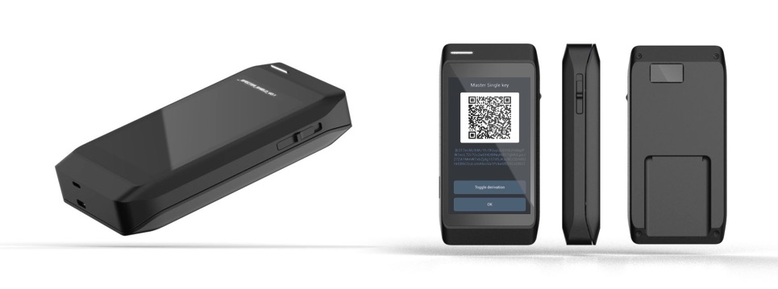

# Specter-devkit

Specter-devkit is an extension board for F469-Discovery board by STMicroelectronics. It uses a standard Arduino headers so it might work with other boards with Arduino headers as well.

It includes a QR scanner, smartcard slot and a battery. All elements are not security-critical - QR scanner only captures images and sends scanned data to the main MCU over dead-simple serial interface, smartcard controller learns nothing about the data transmitted to the secure element as communication with it is encrypted.

Structure diagram, pinout and schematics are available in this folder. To manufacture the kit yourself just send the content of the [`specter-shield`](./specter-shield/) folder to the PCB manufacturer.

For the QR scanner we use GROW GM65-S scanner.

Assembled kit look like this:

3D case is in progress. Should look like this:

