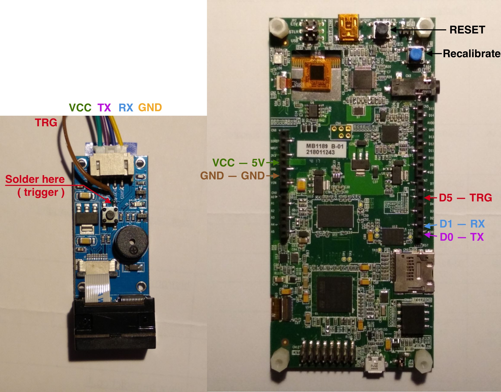

# Assembly of Specter-DIY

## Connecting Waveshare Barcode scanner

The wallet firmware will configure the scanner for you on the first run, so no manual preconfiguration is required.

Here is how you connect the scanner to the board:

For convenience you can buy an Arduino Protype shield and solder & mount everything on it (i.e. [this one](https://www.digikey.com/catalog/en/partgroup/proto-shield-rev3-uno-size/79347))

## Power management

On the top side of the board there is a jumper that defines where it will take power. You can change position of the jumper and select power source to be one of the USB ports or VIN pin and connect external battery there (should be 5V).

## Enclosure for DIY

There are a few case designs made by the community:
- https://www.thingiverse.com/thing:4680700 - very nice design by @SeedSigner, but access to SD card slot for firmware upgrades requires disassembly. You can also buy it from [his shop](https://btc-hardware-solutions.square.site/)
- https://github.com/davewhiiite/wraith - full metal DIY

## [Be creative!](./pictures/gallery/README.md)

Assemble your own Specter-DIY and send us the pictures (make a pull request or reach out to us).

Check out the [Gallery](./pictures/gallery/README.md) with Specters assembled by the community!