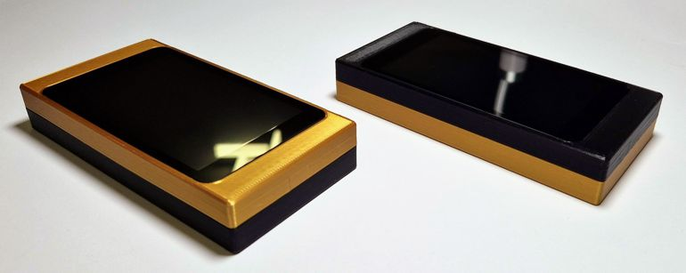
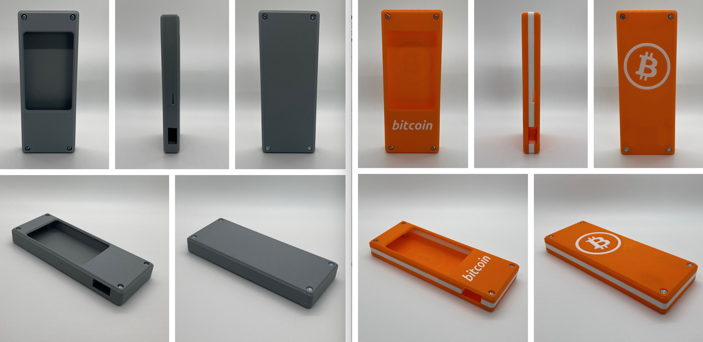
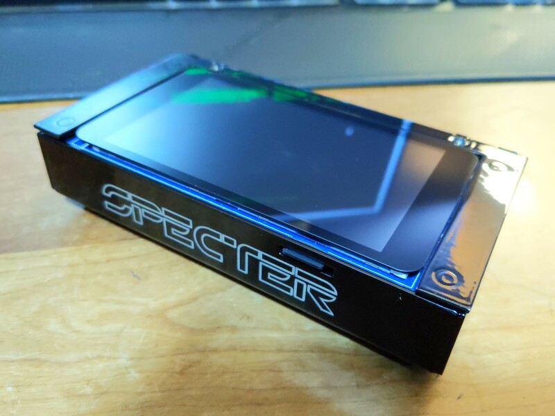
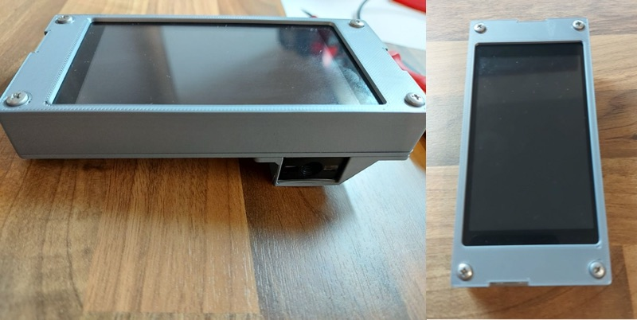

# Enclosures for Specter-DIY

There are a few case designs made by the community:

## Specter-DIY Snap Case

Print it yourself snap case with the waveshare scanner on the backside. 

The printable STL files are available for download in the [snapcase](./snapcase/) folder.

Please note that the prints are quite tight around the hardware components. They are well tested with a Prusa MK3s and Specter hardware components from late 2022. Other printers or newer or older hardware may produce results that do not fit. Please check carefully that the prints do not exert pressure on any hardware components and don't exert any pressure yourself. 

Contact me if you have any questions or suggestions. Success stories are also very welcome. :) You can reach me on [Twitter (@kayth21)](https://twitter.com/kayth21) or on [Telegram (@SeedSticks)](https://t.me/SeedSticks).

You can also buy a snap case, or a fully assembled Specter-DIY, from [bitcoin-store.org](https://bitcoin-store.org).

## SeedSigner's "Barebones" enclosure, v2

Updated design from @SeedSigner (Twitter/Telegram) with a smaller form factor & MicroSD access.

The printable .STL files for v1 and v2 are available for download from the [docs/enclosures/seedsigner](./seedsigner/) folder.

You can also buy the v2, or a fully assembled Specter-DIY, from [his shop](https://btc-hardware-solutions.square.site/).

(E.U. residents can contact @surfacePlasmon (Twitter) or @daz21 (Telegram) to purchase an enclosure via mail or visit diynodes.com)

## Full metal DIY

https://github.com/davewhiiite/wraith

## Enclosure by Thomas

[3d files](./thomas)
