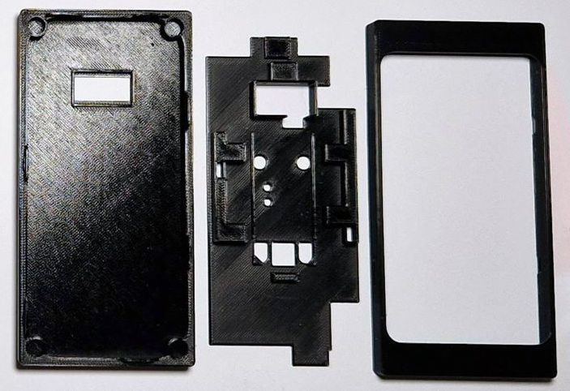

# Specter DIY Snap Case

Specter DIY Snap Case is a print it yourself snap case with the waveshare scanner on the backside. It consists of a middle part, in which the camera is held and the cables are fixed, and an upper and a lower part, which can be plugged together. 

## Please note

The prints are quite tight around the hardware components. They are well tested with a Prusa MK3s and Specter hardware components from late 2022. Other printers or newer or older hardware may produce results that do not fit. Please check carefully that the prints do not exert pressure on any hardware components and don't exert any pressure yourself. 

## Assembly

Please note that this manual assumes that you are familiar with the basic assembly of a Specter DIY and therefore only addresses the specialties associated with this case. If not, please head over to the [docs](../../)

### Print all the parts

- The SDL files are attached to this site. 

### Remove all screws from the scanner

### Mount the scanner module

- Use the two small screws to lock the scanner in the designated position.

### Connect the scanner to the board

- Place the middle part on the board.
- Slide the cables through the channels.
- Connect the cables through the pins to the corresponding slots.

### Plug together the case

- Please double check that the parts are right side up.
- Because of the snaps, you need a little pressure to put them together. Before you put them together, please make sure that the top part fits well over the display.

## Contact

Contact me if you have any questions or suggestions. Success stories are also very welcome. :) You can reach me at @kayth21 (Twitter) or @SeedSticks (Telegram).

## Shop

You can also buy the snap case, or a fully assembled Specter DIY, from [bitcoin-store.org](https://bitcoin-store.org).