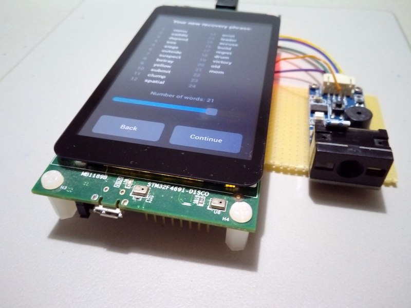
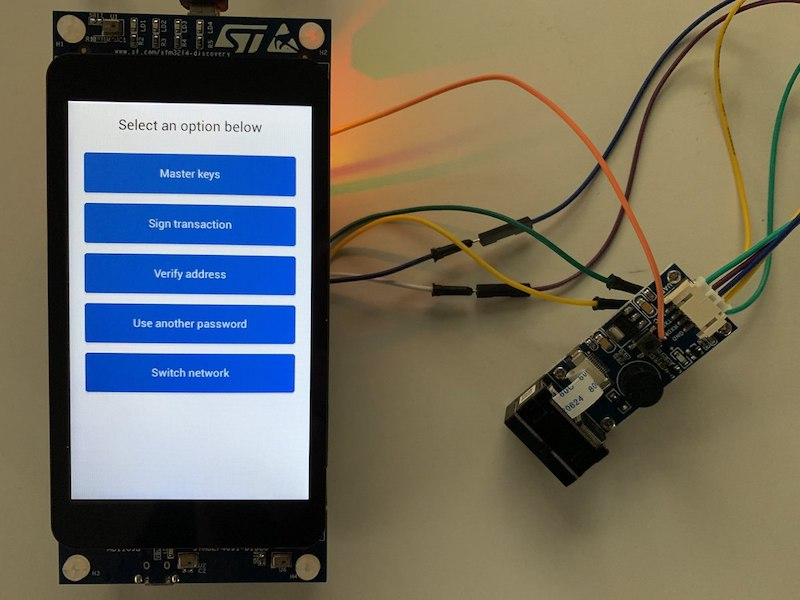
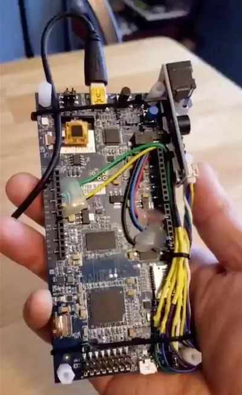
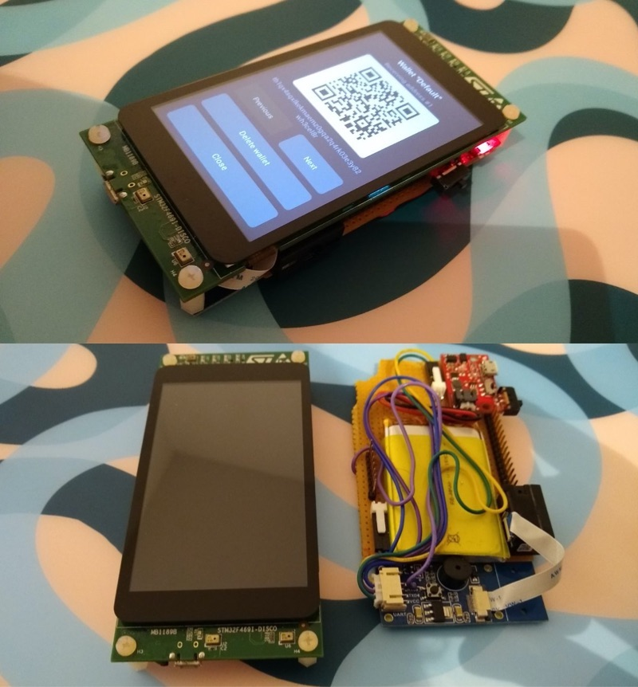

# Gallery

Here are a few pictures from people who assembled their own Specter.

If you did it as well we will be happy to put it here.

### @davewhiiite

### @seedsigner

### @lunaticoin

### @Thomas1378

### @bitcoinheiro

Created 3d printed storage box for this setup with small battery attached and waveshare scanner on the side. Available at https://www.tinkercad.com/things/46xyXAhv0Fy

### @kkdao

### @dimaatmelodromru

### @k9ert

### @gorazdko

### @bavarianledger

### @kdmukai

### @stepansnigirev

### @davewhiiite

### @you?
