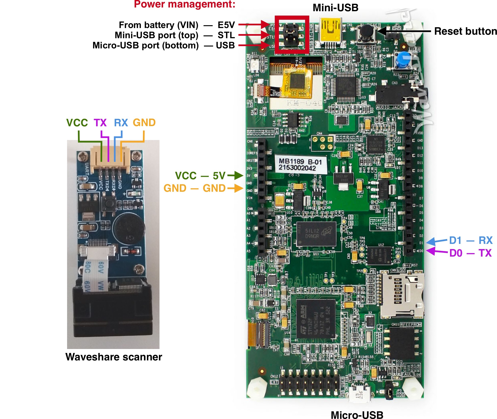

# Waveshare Barcode scanner configuration

By default this scanner uses USB for communication. We need to change this setting to UART.

Configuration is done by scanning special QR codes. It needs to be done only once.

First, power it from microUSB cable (i.e. powerbank or laptop) or from the board - connect VCC cable to 5V of the board and GND to GND.

Then scan the following QR codes one by one. To scan a QR code you need to press the TRG button on the scanner - if scan was successfull you will hear the beep.

Now the scanner is configured and we can connect it to the board. Solder a wire to a button as shown on the picture below and connect the wires.

For convenience you can buy an Arduino Protype shield and solder & mount everything on it (i.e. [this one](https://www.digikey.com/catalog/en/partgroup/proto-shield-rev3-uno-size/79347))