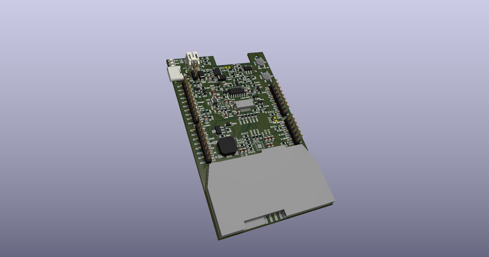

# Shield-BE (Budget Edition)
Work in Progress, currently untested.

The goal of this board is to provide the full functionality of the Specter Shield at a lower price.

The design parameters to enable this are:
*  4 layer PCB with largest dimension 10cm or less, min hole size 0.3mm (keeps cost down, $7 for 5pcbs)
*  All components on one side (keep fab costs down)
*  Generally target 0805 size components (make hand assembly accessible)
*  Prioritize JLCPCB basic parts, even if it means more parts taking up more space (again, to keeps costs down)
*  Can run off usb-c either with or without a battery. (Current full shield needed a battery to work, this board will not)
*  Powers the board directly from USBC when connected, rather than through the battery. (This adds some load constraints depending on what max current we assume for the USBC port. 1.5amp is probably reasonable for usb3 ports that supporting charging and will work for all USBC) Could add a resistor that is easily cut off to drop charge current down so that it will charge *and* run even off an older 1amp supply.
*  Switch mode power supply can deliver 1amp continuous with input from 3v-5v (so plenty of headroom for Specter)
*  For battery varients, can charge the lithium battery and has relevant indicator lights
*  Has power buttons, uses existing pwr_hold functionality and has power indicator when it's on.
*  Multiple varients of same design, one PCB and form factor. (Can have full shield, remove battery for shield core or remove all power for shield lite)
*  Battery level measurement on battery varient (Just using an onboard ADC, will require additional code, but will be straightforward)
*  Fully designed in kicad for portability and maintenance with FOSS tools
*  Reference case in freecad for portability and maintenance with FOSS tools
