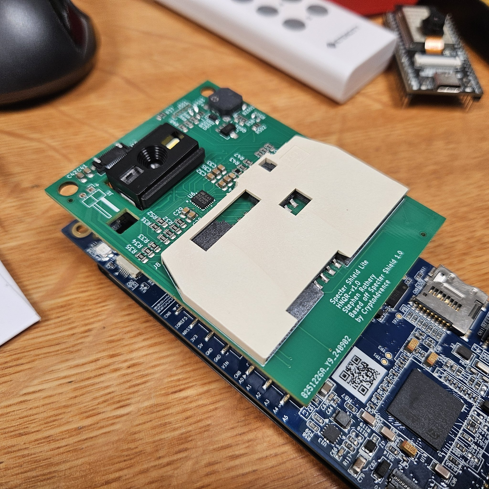

# Specter Shield Lite (Work in Progress)

## Background
Limited availability and high cost have limited the accesibility of the Smartcard based functionality in Specter.

## The Specter Shield-Lite aims to:
+ Implement the QR and Smartcard functionality of the Specter Shield, at a price that is comparable to using the Waveshare QR Scanner for Specter DIY.
+ Preserve the form factor of the Shield to allow re-use of existing cases.
+ Optimise the PCB design and component selection for low cost, short-run production where full hand-assembly is also practical with a standard soldering iron if desired. 
+ Not worry about an integrated battery, but expose the VIN pin so that the user can supply 6-9DC if they want, or just power over USB.
+ Use FOSS design tools (KiCad) to make it easier for others to contribute to the project

## Design Decisions to keep costs low
+ PCB Size - Exceeding 10cm in either dimension typically results in increased costs with most PCB production houses
+ 2 Layer PCB - Double sided PCBs are extremly cheap when compared to 4 layer boards. This is also a fairly simple board, so 2 layer is fine.
+ Keeping all drilled hole sizes above 0.3mm... The existing Shield has a handful (~6) of 0.2mm holes which dramatically increases the production cost.
+ Single Sided Components - Fab houses like JLCPCB have extremely cheap assembly services as long as all components are on a single side of the PCB. (The Pin-Headers are easy to hand solder on)
+ Sticking to common/cheap components where possible, as opposed to more exotic/complex parts. (Minimise 'Extended' parts from fabs like JLCPCB, prefer pin-count <= 16 for fabs like PCBWay)

## Future Work (Still in testing)
+ Swap SmartCard interface IC to something like ST8034ATDT to make it easier to assemble by hand, decreases component count and makes assembly cheaply by PCBWay. (Current QFP package makes assembly expensive with PCBWay, though still cheap with JLCPCB)
+ Look at alternative QR Scanners like the Grow GM805 which are cheaper, remove the need for fine pitch header soldering and also integrate the beeper, to futher drive costs down. (Currently has some compatability issues with binary SeedQR which need to be explored/fixed)