# Specter DIY Case 3D Printing

## 3D Printing

STL and Prusa Gcode files can be downloaded at the following links:

- Grabcad: https://grabcad.com/library/specter-diy-hardware-wallet-case-1
- Thingiverse: https://www.thingiverse.com/thing:4671552

The Prusa Gcode files include a high temperature and low temperature version, we have had good results in PLA with the low temperature setting.

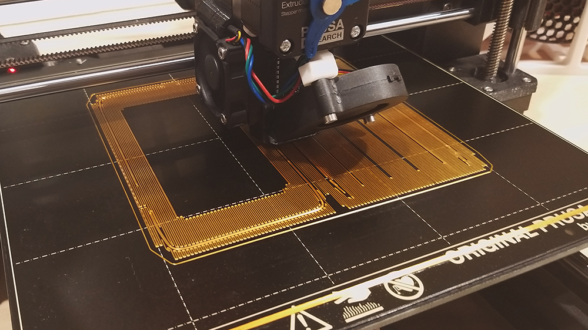

## Post 3D Printing

1. Remove all support material including the ribs on the back case. 
Careful on the inside where the QR code scanner mount is, this is relatively fragile.

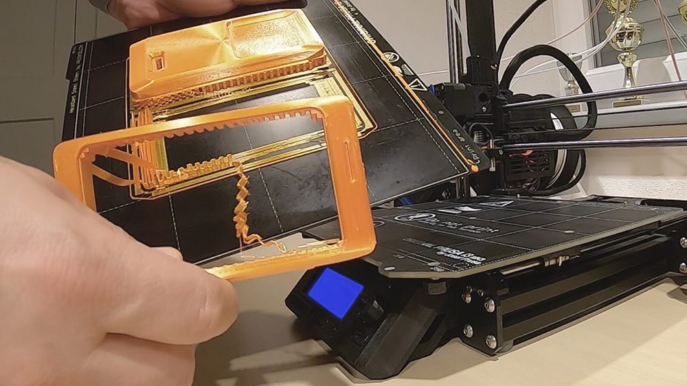

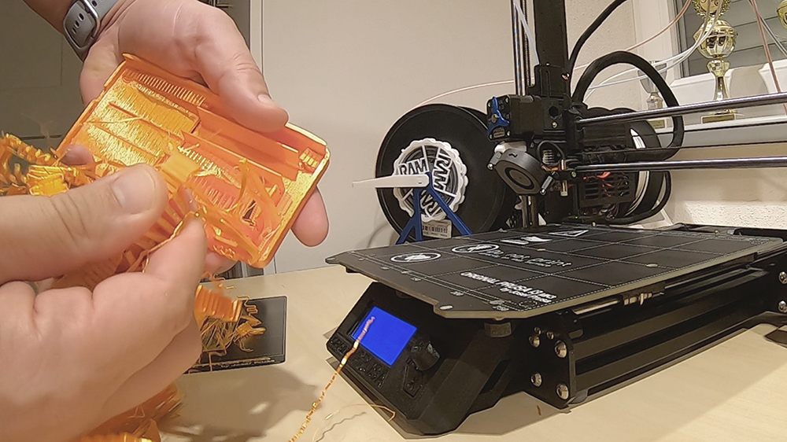

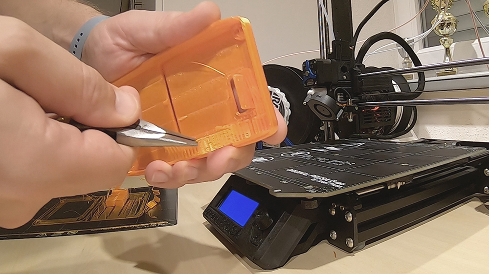

2. For smooth button operation remove the thin layer of support material underneath the button. This can be tested without components inside to ensure there is no friction when pressing.

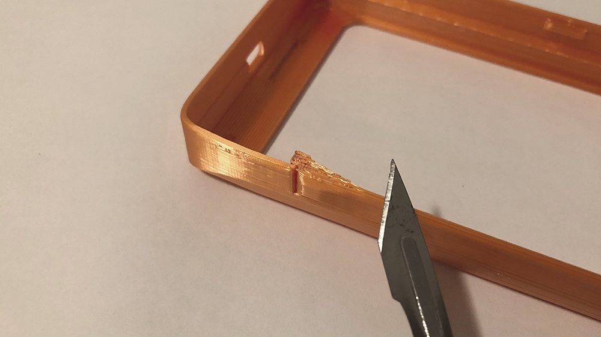

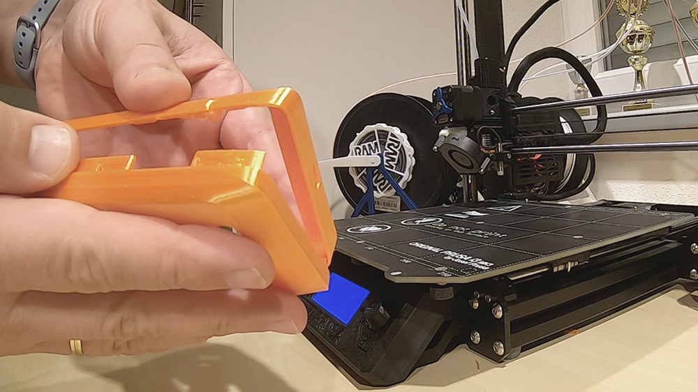

3. M3 nuts of 2mm thickness are used to fix components in the back case, these snap into the case but are best glued in.

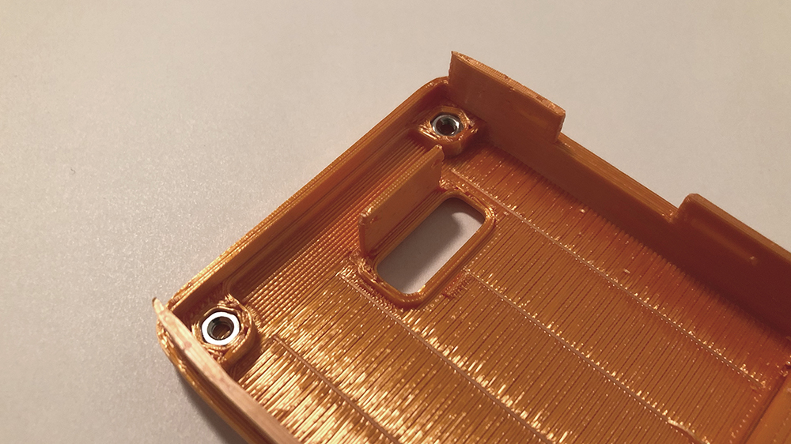

## Specter DIY Assembly

Assembly of Specter DIY components and Specter DIY 3D printed case

Required:

- Specter DIY Case
- Specter Shield
- STM Discovery Board STM32F469I-DISCO
- 6x M3x5mm screws low profile head
- 2x M3 nuts 3mm thick
- 2x 9mm male/female Spacers (6mm thread)
- 2x 12mm female/female Spacers
- 2x M1.4x3mm screws for QR Scanner

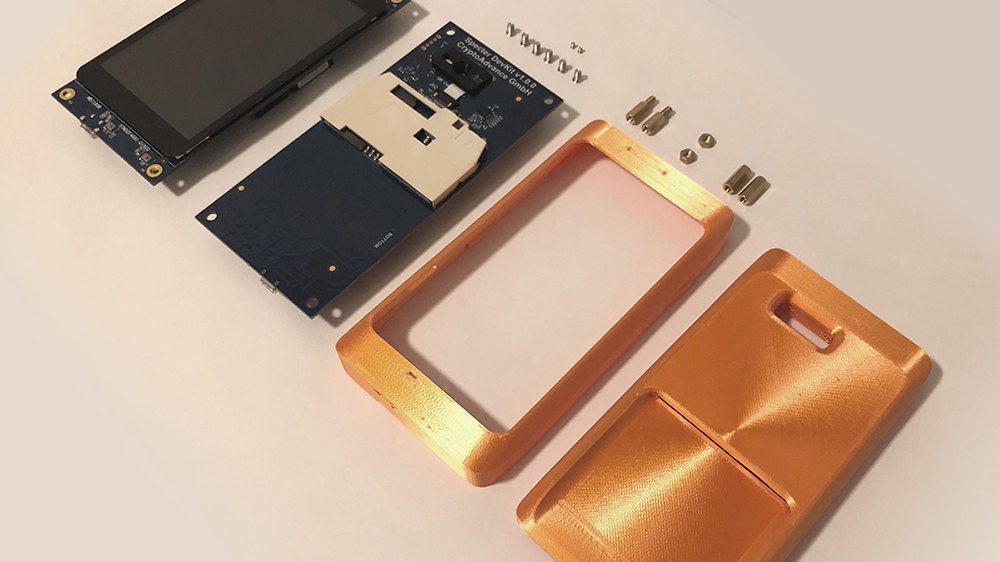

1. Attach the female/female spacers to lower holes in the Specter Shield PCB with two M3 screws.

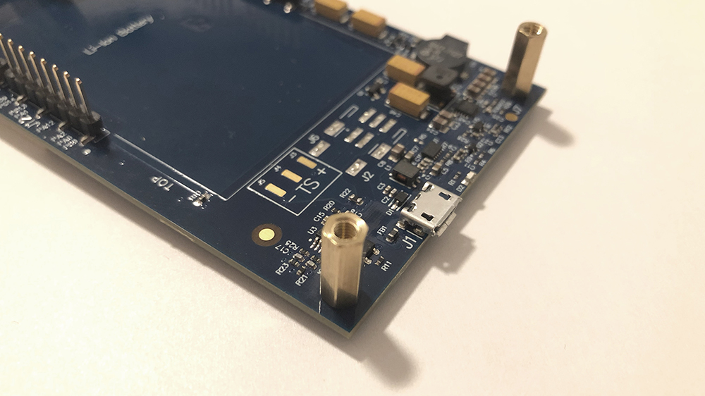

2. Place Specter Shield in the back case. Fix in position with the two male/female spacers using the two M3 nuts to increase offset.

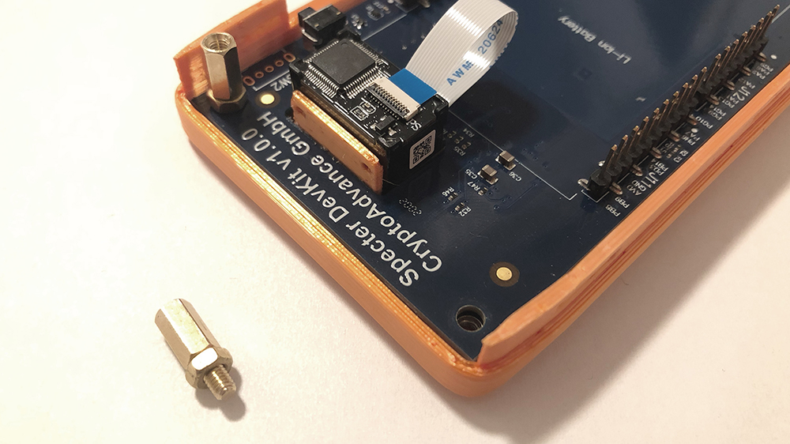

3. Attach STM discovery board and fix in place with 4 M3 screws.

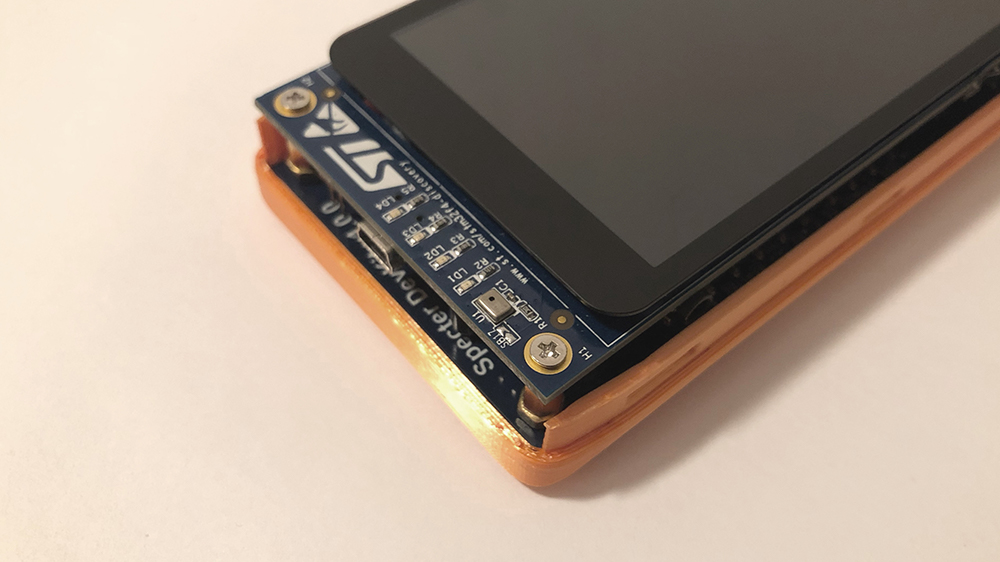

4. Attach front case beginning on the left (side with the SD card slot).

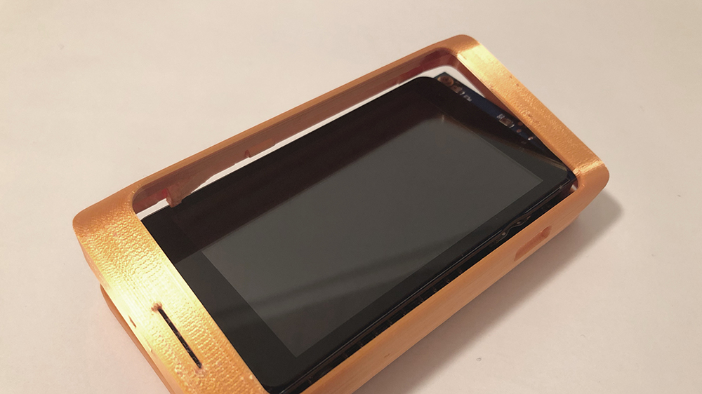

5. Then push right side down, carefully moving the button past the display edge. To snap housing closed takes a bit of pressure.

6. When fully closed the display should be flush with the front of the case. Check that all USB ports are correctly aligned and the Smartcard fits.

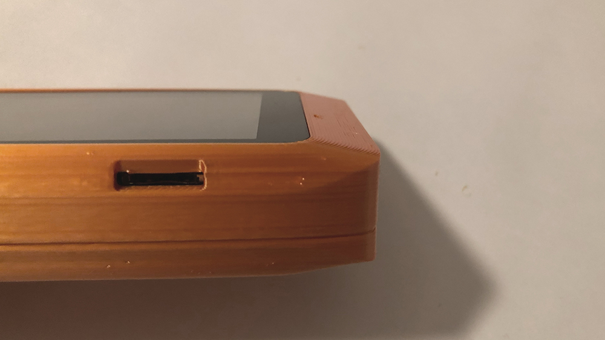

## Opening the case

To open the case it is best to start above the button on the right side. With finger nail lever front case up. Then repeat on the lower right side.

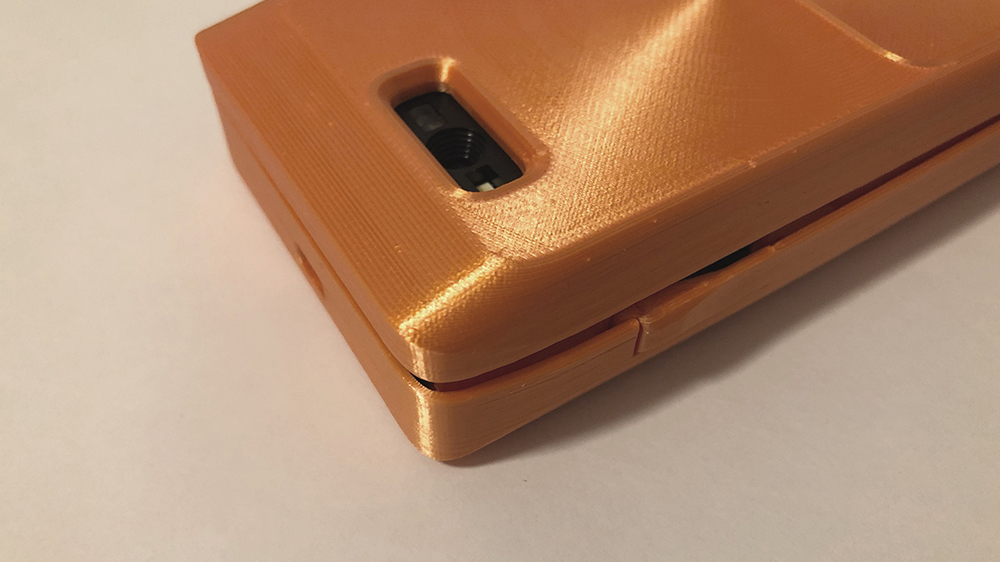

Lift the front case away from the display, carefully moving the button past the display edge.

